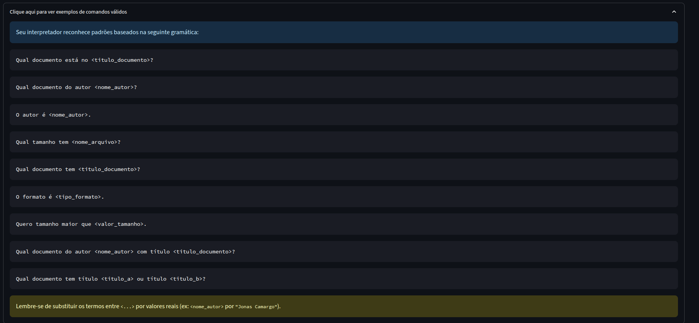

# Interpretador de Linguagem Natural para Consultas de Documentos
## 📖 Visão Geral
Este projeto implementa um interpretador de linguagem natural capaz de traduzir comandos em português para queries estruturadas, utilizadas em Semantic Search. O sistema segue as fases clássicas de um compilador para analisar, interpretar e transformar a entrada do usuário em uma consulta formal que poderia ser usada por um mecanismo de busca de documentos.

O projeto culmina em uma interface web interativa, construída com Streamlit, que permite aos usuários testar o interpretador de forma visual e didática.


## ✨ Funcionalidades Principais
* Análise de Linguagem Natural: Interpreta comandos em português para identificar a intenção do usuário.

* Análise Sintática Baseada em Gramática: Utiliza um conjunto de regras gramaticais formais para validar a estrutura dos comandos.

* Geração de Queries Estruturadas: Converte os comandos reconhecidos em uma query formal, suportando operadores lógicos AND e OR.

* Diálogo Interativo: Lida com comandos incompletos, solicitando ao usuário as informações faltantes para completar a ação.

* Interface Web Didática: Uma aplicação Streamlit que demonstra o funcionamento do interpretador em tempo real, exibindo a Árvore Sintática Abstrata (AST) e a query final gerada.

## 🏛️ Arquitetura do Projeto
A arquitetura do sistema foi projetada de forma modular, espelhando as fases de um compilador tradicional. 

#### 1. Interface com o Usuário
A camada de apresentação construída com Streamlit. Ela captura a entrada do usuário e orquestra o pipeline de processamento.

#### 2. Análise Léxica
Recebe o texto bruto do usuário. Utiliza a biblioteca spaCy para tokenizar o texto, ou seja, dividi-lo em unidades léxicas (tokens). Realiza um pré-processamento para limpar a entrada, removendo stopwords (palavras comuns como "o", "de") e tratando pontuações e frases entre aspas para facilitar a análise. A saída é uma Fila de Tokens que alimenta a próxima fase.

#### 3. Análise Sintática
O coração do interpretador. Recebe a Fila de Tokens e verifica se a sequência obedece às regras definidas na gramática (config.py). Se um comando corresponde perfeitamente a uma regra, ele constrói e retorna uma Árvore Sintática Abstrata (AST). A AST é representada por um dicionário Python que representa a estrutura e os elementos do comando reconhecido, incluindo o operador lógico (AND/OR) inferido a partir da regra.

#### 4. Geração de Query

A fase final. Recebe a AST gerada pelo analisador sintático. Traduz a estrutura da AST para uma string de consulta formal, mapeando os elementos internos (ex: nome_autor) para os campos da query final (ex: Authors).

## 🚀 Como Executar a Aplicação
Siga os passos abaixo para executar a interface web do interpretador.

Pré-requisitos
Python 3.8 ou superior

### 1. Instalação das Dependências
Primeiro, instale todas as bibliotecas necessárias, incluindo o Streamlit. É recomendado criar um ambiente virtual.

```Bash
python -m venv .venv
source .venv/bin/activate # Em Unix  
.venv\Scripts\activate # No Windows:
```

Instale as dependências do arquivo requirements.txt
```Bash
pip install -r requirements.txt

```

### 2. Download do Modelo de Linguagem
O interpretador utiliza um modelo de linguagem da biblioteca spaCy. Faça o download com o seguinte comando:

```Bash
python -m spacy download pt_core_news_sm

```
### 3. Executando a Interface
Com tudo instalado, execute a aplicação Streamlit a partir da pasta raiz do seu projeto.

```Bash
streamlit run app.py
```
Seu navegador será aberto automaticamente com a interface interativa pronta para uso.

### 📋 Exemplos de Comandos Suportados
A interface possui uma seção de exemplos didáticos. Aqui estão alguns comandos que o interpretador consegue entender:

